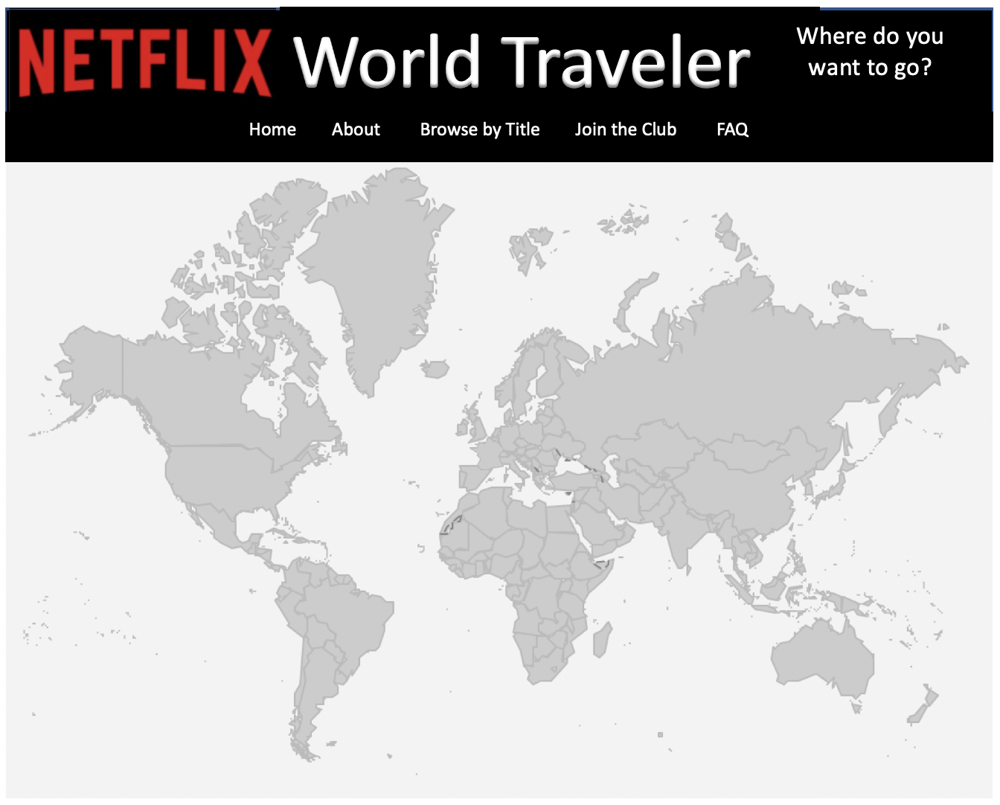
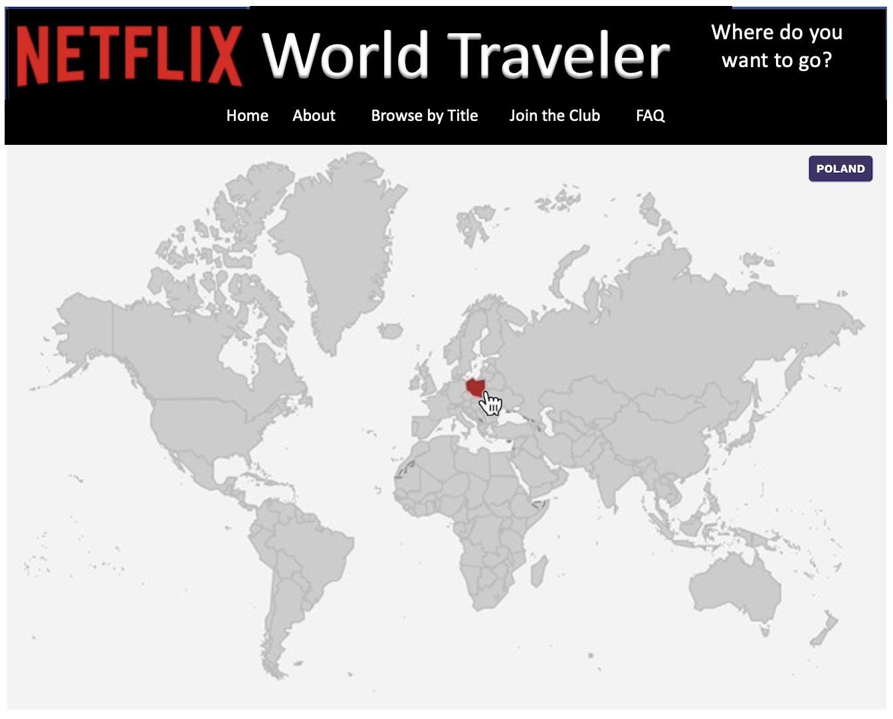

# Netflix_World_Traveler
My personal Netflix project--for educational purposes only 
Complete version coming soon! 
In the meantime, here's the storyboard. 
 
(1) This project analyzes my Netflix <i>ViewingActivity.csv</i> file, which contains over 18,000 records! The focus is on what I think may be Netflix’s best-kept secret–-the existence of hundreds of original TV series from countries all over the world! 
 
 
(2) Click on a country to see the shows I've watched from there. Let's go to Poland! 
 

